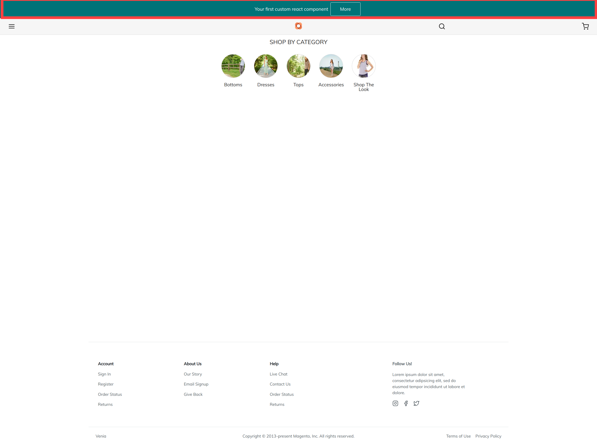

= Demo Repository for PWA Studio Component Overwrite

Since Version 7.0 is possible to use *https://github.com/magento/pwa-studio/blob/release/7.0/CHANGELOG.md#extensibility-framework[Extensibility framework]*
Magento provides different apis but currently is not possible to replace already existing components.
This repository shows a *workaround* to build a standlone PWA Studio Extension.

.Requirements
[NOTE]
We need way how a plugin can register own new components to already existing or extension provider need to many stepes before they can use extension
what will overwrite replacing an existing component.

.Vision
[NOTE]
PWA Studio packages should be able to declare which of their components are safe to replace, and make them replaceable

CAUTION: Replacing a component can be dangerous.It is not a compound change, so if two extensions both want to replace the same file, it can lead to errors.

== How to install

Add to pwa-studio-release-7.0/packages/venia-concept/package.json
[source,bash]
----
"@larsroettig/venia-ui-overwrites": "file:<yourworkspace>/pwa-studio-component-override/packages/venia-ui-overwrites",
"@larsroettig/top-bar-plugin": "file:<yourworkspace>/pwa-studio-component-override/packages/top-bar-plugin",
----

